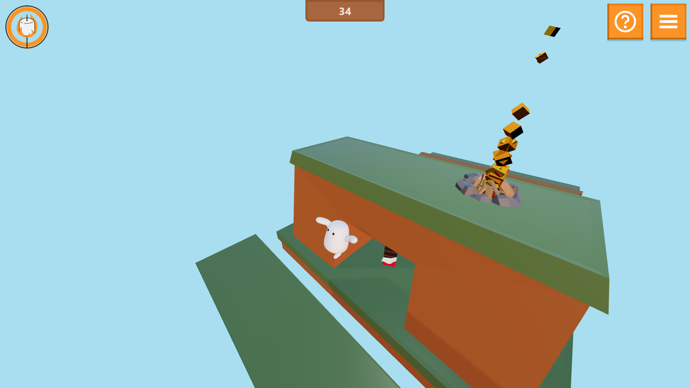

# Melted Marsh

### What is Melted Marsh?
**Melted Marsh** is a website game where you are a marshmallow guy (Marshy) and you need to get near the campfire before the fire lights out. This game introduced my coding skills that I have learned, including 3D modeling that is rendered by ThreeJS and also with physics controlled by Rapier. For the campfire particle I generated with Three-Nebula. I created this when I was in grade 12 for improve myself.
   
**Melted Marsh** เป็นเกมบนเว็บไซต์ที่ให้ผู้เล่นจะเล่นเป็นมาร์ชเมลโลว์ (Marshy) และต้องเข้าไปใกล้ๆกองไฟก่อนที่กองไฟจะดับ เกมๆนี้สร้างขึ้นเพื่อแสดงทักษะการเขียนโค้ดที่ผมได้เรียนรู้มาหลายๆอย่าง ซึ่งรวมถึงการสร้างโมเดล 3 มิติที่เรนเดอร์โดย ThreeJS และควบคุมด้วยฟิสิกส์โดย Rapier สำหรับแคมป์ไฟผมสร้าง particle ด้วย Three-Nebula และผมสร้างเกมนี้ขึ้นมาเมื่อตอนอยู่ชั้นมัธยมศึกษาปีที่ 6 เพื่อเรียนรู้และพัฒนาตนเอง😊
 
 
 
### Method
This game is controlled with WASD Keys and Mouse the same as with a normal game, you need to get near the campfire before the timer runs out. There are eight levels, each level has a score and timer differently, the score is getting higher as the faster you reach the campfire. 
   
เกมนี้ใช้ปุ่ม WASD และเมาส์ควบคุมเหมือนกับเกมทั่วๆไป โดยที่ผู้เล่นต้องเข้าใกล้กองไฟก่อนที่เวลาจะหมดลง เกมนี้มีทั้งหมด 8 ด่าน แต่ละด่านจะมีคะแนนและตัวจับเวลาแตกต่างกัน คะแนนจะยิ่งสูงขึ้นตามความเร็วที่ผู้เล่นไปถึงกองไฟได้เร็วยิ่งขึ้น
 
 
 

### Used Language/Tools

  &nbsp;
  &nbsp;
  &nbsp;
  &nbsp;
  &nbsp;
  &nbsp;

   

This website is under development. However, It playable on desktop only and you can still play as demo by click on green button that say <>Code >> Download Zip >> Extract All >> Open in VSCode and use "npm run dev" in terminal.(don't forget to cd location)
It will playable as website when it finished.

### Flowchart 

  

   

### Website Interface

  
  
  
  

